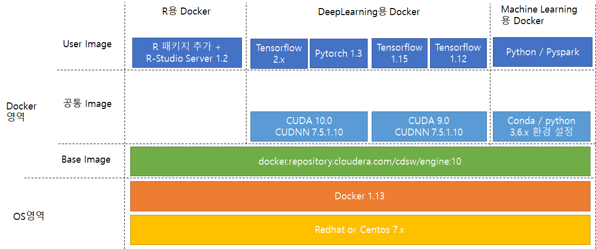

# 삼성증권 CDSW Custom Image

## CDSW용  도커 이미지 만들기

- R / R-Studio 참고 자료 
   - https://docs.cloudera.com/documentation/data-science-workbench/1-7-x/topics/cdsw_editors_browser.html

- DeepLearning( GPU )용 참고 자료   
   - https://docs.cloudera.com/documentation/data-science-workbench/1-7-x/topics/cdsw_gpu.html

- Conda / Python용 참고 자료
   - https://docs.cloudera.com/documentation/data-science-workbench/1-7-x/topics/cdsw_install_pkg_lib.html

- 아래 도커 이미지 생성은 CDSW가 설치되지 않는 환경에서도 생성이 가능하며, docker1.13 버전 이상 설치된 리눅스( centos계열, 우분투계열)에서 빌드 가능


## Docker 이미지 구조




## 1. R/R-Studio를 사용하는 도커 이미지 만들기 


- rstudio.{company domain}.Dockerfile 파일 생성 
```
#Dockerfile Naming Rule : rstudio.{company domain}.Dockerfile
#                                    회사의 도메인명                
# 예시  :  rstudio.ss.local.Dockerfile
#       rstudio.kolon.com.Dockerfile

FROM docker.repository.cloudera.com/cdsw/engine:10

WORKDIR /tmp

#The RUN commands that install an editor
#For example: RUN apt-get install myeditor

RUN apt-get update && apt-get dist-upgrade -y && \
    apt-get install -y --no-install-recommends \
            libclang-dev \
            lsb-release \
            psmisc \
            libapparmor1 \
            sudo libssl-dev \
            libmariadb-client-lgpl-dev \
            mysql-client libmysqlclient20 \
            libxml2-dev  libnlopt-dev  \
            unixodbc-dev iodbc libiodbc2  \
            xorg libx11-dev  libglu1-mesa-dev  libfreetype6-dev   \
            libgmp-dev   libblas-dev libblas3

RUN wget https://download2.rstudio.org/server/trusty/amd64/rstudio-server-1.2.1335-amd64.deb && \
    dpkg -i rstudio-server-1.2.1335-amd64.deb

COPY rserver.conf /etc/rstudio/rserver.conf

COPY rstudio-cdsw /usr/local/bin/rstudio-cdsw

RUN chmod +x /usr/local/bin/rstudio-cdsw

## 필요한 R 패키지 설치
ENV REPO_URL  https://cran.seoul.go.kr/
RUN R -e "install.packages('패키지명01', repos='${REPO_URL}') " && \
    R -e "install.packages('패키지명02', repos='${REPO_URL}') " && \ 
    R -e "install.packages('패키지명03', repos='${REPO_URL}') " 
#   .... 

```


- rserver.conf  파일 생성  
```
# Must match CDSW_APP_PORT
www-port=8090
server-app-armor-enabled=0
server-daemonize=0
www-address=127.0.0.1
auth-none=1
auth-validate-users=0
```

- rstudio-cdsw  파일 생성  
```
#!/bin/bash

# This saves RStudio's user runtime information to /tmp, which ensures several
# RStudio sessions can run in the same project simultaneously
mkdir -p /tmp/rstudio/sessions/active
mkdir -p /home/cdsw/.rstudio/sessions
if [ -d /home/cdsw/.rstudio/sessions/active ]; then rm -rf /home/cdsw/.rstudio/sessions/active; fi
ln -s /tmp/rstudio/sessions/active /home/cdsw/.rstudio/sessions/active

# This ensures RStudio picks up the environment. This may not be necessary if
# you are installing RStudio Professional. See
# https://docs.rstudio.com/ide/server-pro/r-sessions.html#customizing-session-launches.
# SPARK_DIST_CLASSPATH is treated as a special case to workaround a bug in R
# with very long environment variables.
env | grep -v ^SPARK_DIST_CLASSPATH >> /usr/local/lib/R/etc/Renviron.site
echo "Sys.setenv(\"SPARK_DIST_CLASSPATH\"=\"${SPARK_DIST_CLASSPATH}\")" >> /usr/local/lib/R/etc/Rprofile.site

# Now start RStudio
/usr/sbin/rstudio-server start
```

- Dockerfile 빌드 방법
```
ANALYSIS_PJT=ss.local

# Docker images Naming Rule   : rstudio.{company domain}:/cdsw/engine:10 
#                                 회사의 도메인명                cdsw의 engine v8에서 생성을 의미
# 예시  :  rstudio.ss.local:/cdsw/engine:10
#        rstudio.kolon.com:/cdsw/engine:10
#        rstudio.samsung.com:/cdsw/engine:10

docker build --network=host  -t rstudio.${ANALYSIS_PJT}:/cdsw/engine:10 . -f rstudio.${ANALYSIS_PJT}.Dockerfile

```

- Docker image를 파일로 추출
```
ANALYSIS_PJT=ss.local
TODAY=`date "+%y%m%d"`

docker save  rstudio.${ANALYSIS_PJT}/cdsw/engine:10  | gzip > rstudio.${ANALYSIS_PJT}_${TODAY}.tar.gz 
```

- rstudio.${ANALYSIS_PJT}_${TODAY}.tar.gz  파일을 전달

 

## 2. GPU를 사용하지 않는 conda/python 패키지를 사용하는 도커 이미지 만들기  
- python2.x 사용하지 않으므로  python3.x 용만 설명


  
- conda.{company domain}.Dockerfile 파일 생성 
```
FROM docker.repository.cloudera.com/cdsw/engine:10

RUN cd /tmp/ && \
    apt-get update &&  \
    apt-get install -y --no-install-recommends  \
            language-pack-ko  \
            libssl-dev \
            libmariadb-client-lgpl-dev \
            mysql-client libmysqlclient20 \
            libxml2-dev  libnlopt-dev  \
            unixodbc-dev iodbc libiodbc2  \
            xorg libx11-dev  libglu1-mesa-dev  libfreetype6-dev   \
            libgmp-dev   libblas-dev libblas3 \
            libstdc++6  libcupti-dev openjdk-8-jdk	&& \
    wget -O impala.deb --no-check-certificate https://downloads.cloudera.com/connectors/impala_odbc_2.5.41.1029/Debian/clouderaimpalaodbc_2.5.41.1029-2_amd64.deb && \
    wget -O hive.deb --no-check-certificate  https://downloads.cloudera.com/connectors/ClouderaHive_ODBC_2.6.4.1004/Debian/clouderahiveodbc_2.6.4.1004-2_amd64.deb && \
    dpkg -i  impala.deb hive.deb  && \
    rm -rf  *.deb && rm -rf /var/lib/apt/lists/*  && \
    mv /etc/default/locale /etc/default/locale.bak  && \
    echo "LANG=\"ko_KR.UTF-8\"" >> /etc/default/locale && \
    echo "LANGUAGE=\"ko_KR:ko\"" >> /etc/default/locale 

RUN mkdir -p /opt/conda/envs/python3.6  && \
    conda install -y nbconvert python=3.6.9 -n python3.6 && \
    conda clean -a  

# JupyterLab 설치 
RUN /opt/conda/envs/python3.6/bin/pip install --no-cache-dir --no-clean  jupyterlab  && \
    pip3 install --no-cache-dir --no-clean  jupyterlab	
	     
# 필요한 패키지는  1차로 conda로 실치 시도하고 설치 실패시 PIP로 설치함.
# Conda 패키지 설치할때  : 
RUN conda install -y -n python3.6  numpy && \
    conda install -y -n python3.6  beautifulsoup4  && \
    # 패키지 추가   ... 
    conda clean -a  	     

# PIP로 패키지 설치할때    
RUN /opt/conda/envs/python3.6/bin/pip install --no-cache-dir --no-clean  \
    gputil gym  ... 
	     
```


- Dockerfile 빌드 방법
```
ANALYSIS_PJT=ss.local

# Docker images Naming Rule   : conda.{company domain}:/cdsw/engine:10 
#                                    회사의 도메인명                cdsw의 engine v8에서 생성을 의미
# 예시  :  conda.ss.local:/cdsw/engine:10
#        conda.kolon.com:/cdsw/engine:10
#        conda.samsung.com:/cdsw/engine:10

docker build --network=host  -t conda.${ANALYSIS_PJT}:/cdsw/engine:10 . -f conda.${ANALYSIS_PJT}.Dockerfile

```

- Docker image를 파일로 추출
```
ANALYSIS_PJT=ss.local
TODAY=`date "+%y%m%d"`

docker save  conda.${ANALYSIS_PJT}/cdsw/engine:10  | gzip > conda.${ANALYSIS_PJT}_${TODAY}.tar.gz 
```

- conda.${ANALYSIS_PJT}_${TODAY}.tar.gz  파일을 전달


## 3. GPU를 사용하는 파이션 패키지(tensorflow, pytorch, xgboost-gpu) 를 사용하는 도커 이미지 만들기  

- Tensorflow2.x , pytorch1.3은  CUDA10 버전 사용
- Tensorflow1.x 등은 CUDA9 버전 사용 


- cuda9.{company domain}.Dockerfile 파일 생성 
```
FROM  docker.repository.cloudera.com/cdsw/engine:10

RUN release="ubuntu1604" && \
    echo $release &&  \
    apt-key adv --fetch-keys http://developer.download.nvidia.com/compute/cuda/repos/"$release"/x86_64/7fa2af80.pub && \
    echo "deb http://developer.download.nvidia.com/compute/cuda/repos/$release/x86_64 /" > /etc/apt/sources.list.d/cuda.list  && \
    echo "deb http://developer.download.nvidia.com/compute/machine-learning/repos/$release/x86_64 /" > /etc/apt/sources.list.d/nvidia-ml.list

ENV CUDA_VERSION 9.0.176
LABEL com.nvidia.cuda.version="${CUDA_VERSION}"

ENV CUDA_PKG_VERSION 9-0_$CUDA_VERSION-1
RUN apt-get update &&  \
    apt-get install -y --no-install-recommends  \
            cuda-cudart-9-0 cuda-cublas-9-0  cuda-cufft-9-0 cuda-curand-9-0 cuda-cusolver-9-0 cuda-cusparse-9-0  && \
    ln -s cuda-9.0 /usr/local/cuda && \
    rm -rf /var/lib/apt/lists/*

RUN echo "/usr/local/cuda/lib64" >> /etc/ld.so.conf.d/cuda.conf && \
    ldconfig

RUN echo "/usr/local/nvidia/lib" >> /etc/ld.so.conf.d/nvidia.conf && \
    echo "/usr/local/nvidia/lib64" >> /etc/ld.so.conf.d/nvidia.conf

ENV PATH /usr/local/nvidia/bin:/usr/local/cuda/bin:${PATH}
ENV LD_LIBRARY_PATH /usr/local/nvidia/lib:/usr/local/nvidia/lib64


ENV CUDNN_VERSION 7.5.1.10
LABEL com.nvidia.cudnn.version="${CUDNN_VERSION}"

RUN apt-get update && apt-get install -y --no-install-recommends \
            libcudnn7=$CUDNN_VERSION-1+cuda9.0 && \
    apt-mark hold libcudnn7 && \
    rm -rf /var/lib/apt/lists/*

```

 
- cuda10.{company domain}.Dockerfile 파일 생성 
```
FROM  docker.repository.cloudera.com/cdsw/engine:10

RUN release="ubuntu1604" && \
    echo $release &&  \
    apt-key adv --fetch-keys http://developer.download.nvidia.com/compute/cuda/repos/"$release"/x86_64/7fa2af80.pub && \
    echo "deb http://developer.download.nvidia.com/compute/cuda/repos/$release/x86_64 /" > /etc/apt/sources.list.d/cuda.list  && \
    echo "deb http://developer.download.nvidia.com/compute/machine-learning/repos/$release/x86_64 /" > /etc/apt/sources.list.d/nvidia-ml.list

ENV CUDA_VERSION 10.0.130
LABEL com.nvidia.cuda.version="${CUDA_VERSION}"

ENV CUDA_PKG_VERSION 10-0_$CUDA_VERSION-1
RUN apt-get update &&  \
    apt-get install -y --no-install-recommends cuda-cudart-10-0 && \
    ln -s cuda-10.0 /usr/local/cuda && \
    rm -rf /var/lib/apt/lists/*

RUN echo "/usr/local/cuda/lib64" >> /etc/ld.so.conf.d/cuda.conf && \
    ldconfig

RUN echo "/usr/local/nvidia/lib" >> /etc/ld.so.conf.d/nvidia.conf && \
    echo "/usr/local/nvidia/lib64" >> /etc/ld.so.conf.d/nvidia.conf

ENV PATH /usr/local/nvidia/bin:/usr/local/cuda/bin:${PATH}
ENV LD_LIBRARY_PATH /usr/local/nvidia/lib:/usr/local/nvidia/lib64


ENV CUDNN_VERSION 7.5.1.10
LABEL com.nvidia.cudnn.version="${CUDNN_VERSION}"

RUN apt-get update && apt-get install -y --no-install-recommends \
            libcudnn7=$CUDNN_VERSION-1+cuda10.0 && \
    apt-mark hold libcudnn7 && \
    rm -rf /var/lib/apt/lists/*
```


- tensorflow2.0 예시 :  tensorflow2.0.{company domain}.Dockerfile 파일 생성 
```
FROM  cuda10.{company domain}/cdsw/engine:10

RUN /opt/conda/envs/python3.6/bin/pip  install --no-cache-dir --no-clean  \
        tensorflow-gpu==2.0  Keras 

```

- pytorch1.3 예시 : pytorch1.3.{company domain}.Dockerfile 파일 생성 
```
FROM  cuda10.{company domain}/cdsw/engine:10

RUN conda install -n python3.6 -c anaconda pytorch-gpu=1.3.1 torchvision  

```

- tensorflow2.0 / pytorch1.3 빌드 예시
```
ANALYSIS_PJT=ss.local
TODAY=`date "+%y%m%d"`

docker build --network=host -t cuda9.${SITE_DOMAIN}/cdsw/engine:10 .   -f  cuda9.${SITE_DOMAIN}.Dockerfile  
docker build --network=host -t cuda10.${SITE_DOMAIN}m/cdsw/engine:10 . -f  cuda10.${SITE_DOMAIN}.Dockerfile


docker build --network=host -t tensorflow2.0.${SITE_DOMAIN}/cdsw/engine:10 . -f  tensorflow2.0.${SITE_DOMAIN}.Dockerfile
docker build --network=host -t pytorch1.3.${SITE_DOMAIN}/cdsw/engine:10    . -f  pytorch1.3.${SITE_DOMAIN}.Dockerfile
# tensorflow1.x, xgboot 등 추가
```

- Docker image를 파일로 추출
```
ANALYSIS_PJT=ss.local
TODAY=`date "+%y%m%d"`

docker save  tensorflow2.0.${ANALYSIS_PJT}/cdsw/engine:10  | gzip > tensorflow2.0.${ANALYSIS_PJT}_${TODAY}.tar.gz 
docker save  pytorch1.3.${ANALYSIS_PJT}/cdsw/engine:10     | gzip > pytorch1.3.${ANALYSIS_PJT}_${TODAY}.tar.gz 
```


